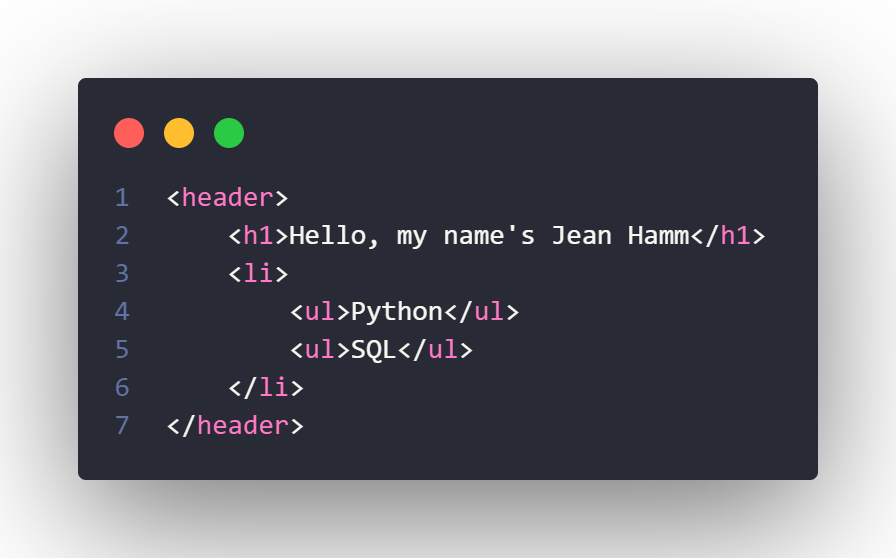

### My languagens

  &nbsp;&nbsp;   &nbsp;&nbsp;   

&nbsp;&nbsp;&nbsp;&nbsp;&nbsp;&nbsp;&nbsp;&nbsp;&nbsp;&nbsp;&nbsp;&nbsp; 
&nbsp;&nbsp;
&nbsp;&nbsp;

<h3>Follow me</h3>

  &nbsp;&nbsp;
          

